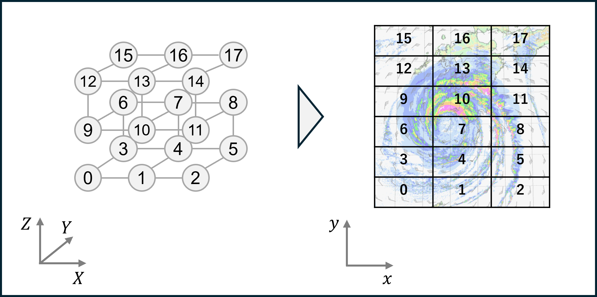

# CReSS on Supercomputer Fugaku

Here, we will demonstrate how to use CReSS optimally on Fugaku.
The main optimizations are as follows:

| Directory | Description |
| -- | -- |
| SrcDevelop/FGK1.1/ | Modified source codes |
| Fugaku_script/ | Scripts for Fugaku usage |
| Doc/FGK1.1/ | This README |

## Compilation

At first, activate FGK1.1 version by `configure.csh fgk`.
Then, compile with `compile.conf.fugaku` on Fugaku login node.
Modify the script on your situation.

## Execution

### Command

Execute the following three scripts in sequence:

1. `pjsub preprocess.sh`
2. `pjsub solver.sh`
3. `pjsub postprocess.sh`

### Modification

Pay special attention to modifying the following settings:

* General setting
    * Modify job script parameters, such as `node`, `elapse`, and `group name`.
* Preprocess
    * `crsdir`: directory specified in `user.conf`
    * `bin_dir`: directory path including `terrain.exe`, `surface.exe`, and `gridata.exe`
    * `conf_path`: path of `user.conf`
* Solver
    * `vcoord_file_path`: Path of `vcoord_file` if use (See detail next section)
    * `conf_path`: path of `user.conf`
    * `solver_path`: path of `solver.exe`
* Postprocess
    * `crsdir`: directory specified in `user.conf`
    * `conf_path`: path of `user.conf`
    * `unite_path`: path of `unite.exe`

### Notice

* Use the `-Wl,-T` option to read files in big endian format.

## Optimization Techniques

### Rank Assignment

To reduce redundant communication, adjacent computational domains are assigned to neighboring physical nodes, which are oriented in the XYZ directions.
This approach can lead to faster computation times, while it may result in delayed job start times.
The allocation strategy involves assigning x-direction computational domains to nodes in the X direction for each process, while y-direction computational domains are alternately folded and mapped onto the three-dimensional node structure in the Y and Z directions.



#### Example Configuration

The relationship between processes and nodes is described in `vcoord_file`.
The `vcoord_file` is generated by `generate_vcoord.py`.
When computational domain is divided into 32x64 (`xsub = 32`, `ysub = 64`), the total number of processes is 2048 (`numpe = 2048`).
Given that each node runs 4 processes with 12 threads (`proc = 4`, `thread = 12`), the number of nodes is 512.
First, determine X dimension by calculating `X = xsub/proc = 32/4 = 8`.
Then, set the remaining nodes to satisfy `Y*Z = 512/8 = 64`.
In this example, the numbers of Y and Z nodes are set as `Y=8` and `Z=8`.

Run the following command.
After `vcoord_file` is generated, rename and move it as needed.
Set the path in `solver.sh`.

```
$ python3 generate_vcoord.py -h
usage: generate_vcoord.py [-h] [-f FILE_NAME] [-x X] [-y Y] [-z Z] [-p PROC] [-t THREAD]

Generate a vcoord file for the supercomputer Fugaku.

options:
  -h, --help            show this help message and exit
  -f FILE_NAME, --file_name FILE_NAME
                        Name of the output file (default: ./vcoord_file)
  -x X, --x X           Number of X dimensions (default: 8)
  -y Y, --y Y           Number of Y dimensions (default: 8)
  -z Z, --z Z           Number of Z dimensions (default: 8)
  -p PROC, --proc PROC  Number of processes (default: 4)
  -t THREAD, --thread THREAD
                        Number of threads per process (default: 12)

$ python3 generate_vcoord.py -f ./vcoord_file -x 8 -y 8 -z 8 -p 4 -t 12
[INFO]: Configuration uses all 48 available cores.

[INFO]: Node configuration: 8x8x8
[INFO]: Number of processes: 4
[INFO]: Number of threads: 12

[INFO]: Output file: ./vcoord_file
[INFO]: Job script description: "node=8x8x8:torus:strict"
```

### Using Subdirectories in CReSS Directory

Fugaku system forbids accessing many processes to a directory.
To change `subdir_proc` in user.conf, processes use each subdirectory.

```fortran
 &drname
  crsdir = './result'

  datdir = './external_data'

  subdir_proc = 1000  ! Number of processes per subdirectory (not create subdirectory when 0)
 /
```

```bash
$ ls ./result
0 1000 2000
```

### Using 9-Digit Process Numbers

The file format of CRess is, such as `exprim.dmp000000.pe0000.bin` in default.
In this file name, the number of max processes is 10000.
To enhance available number of processes, the codes modified to express process number in 9-digits, such as `exprim.dmp000000.pe000000000.bin`.

### Vectorized Output

CReSS outputs dmp files by looping z-direction in unformatted mode, which can potentially become a bottleneck in cluster system.
To prevent the output slow down, stream output is supported.
Setting `dmpfmt = 3` leads to vectorized z-direction output, not looped.

```fortran
 &outfomat
  dmpfmt =     3       ! integer(kind=[4bytes])
                       ! Option for dumped file format
                       !   1: Output by text format
                       !   2: Output by binary format
                       !   3: Output by binary format with stream
 /
```

### Optimized Unite Algorithm

To speed up the unite algorithm in cluster system, two modifications were implemented.

#### Organize Data in Memory

The original unite algorithm is below.

1. Firstly, make empty united file.
2. Read several partial files and gather all the data.
3. Write partial data to appropriate location in united file
4. Loop through all partial files.

However, this implementation can be slow operation, especially in cluster system.
In such a system, organizing data in memory and reducing the number of IO operations are expected to be faster.
To adjust the unite algorithm to Fugaku, the operation was modified:

1. Read all partial files with several data.
2. Organize read data order in memory.
3. Write organized chunk data to united file.
4. Loop until all data is read.

The tuned implementation is activated by setting the `bufsz_uni` parameter.
This parameter means buffer size of organizing data in memory.
A higher value is expected to speed up uniting, but it may cause memory errors.
At least, set it less than twice available memory size for reading and organize buffers.
For example, set it less than `16.e9` in Fugaku system because the memory size of a node is 32 GB.
When not using tuned algorithm, set `bufsz_uni = 0`.

```fortran
 &uniconf_uni
  bufsz_uni  = 12.e9   ! real(kind=[4bytes])
                       ! Read/write buffer size, using twice the size [byte]
                       ! The higher the number of read/write, the faster the execution
                       !   0: Not use memory organization (conventional)
 /
```

#### Parallel Unite Execution

The time series data output is independent.
Therefore, the parallel unite algorithm is supported.
Note that the unite algorithm is IO intensive task.
Namely, parallel uniting in a node is not effective.
The recommendation is one process per node, using multiple nodes.

The program is executed by `mpiexec` (see postprocess.sh) after The execution file is compiled by:

```bash
./compile.csh unite_multi compile.conf
```
